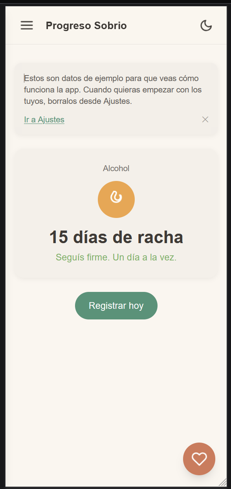
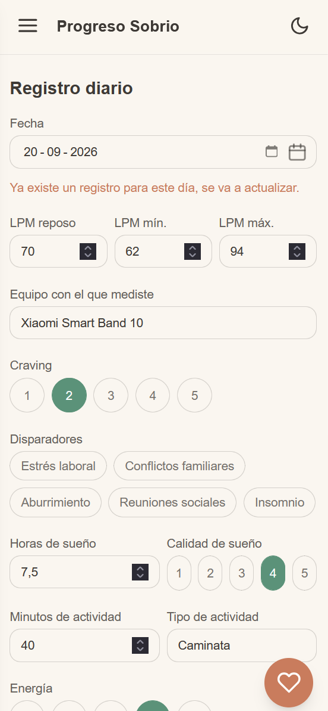
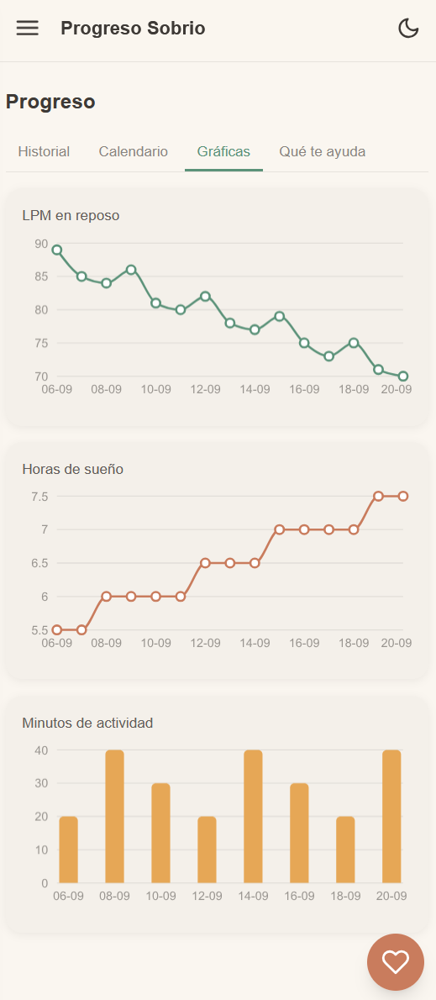
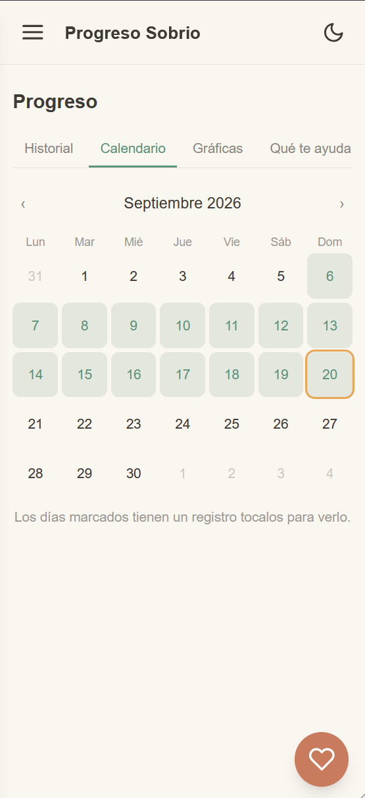
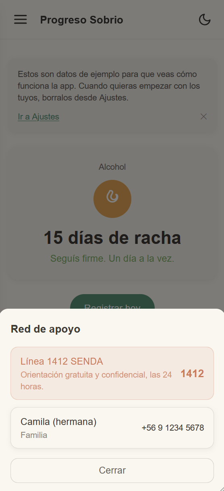
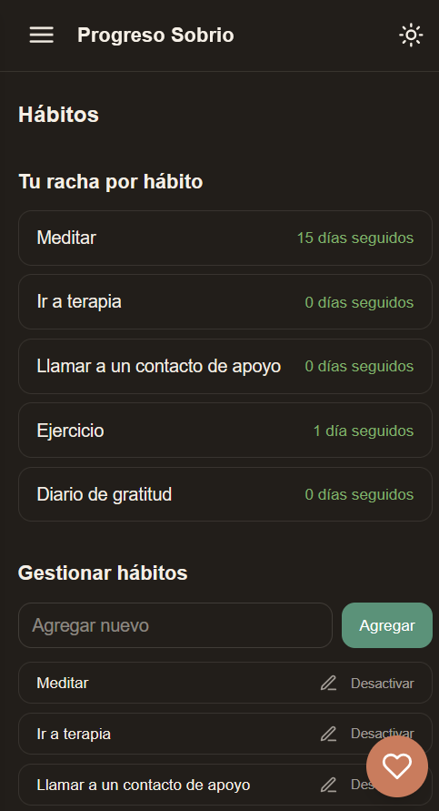

# Progreso Sobrio

Acompaña el día a día de una persona en proceso de abstinencia de sustancias, sin juzgar, sin dar diagnósticos, un día a la vez.

> Progreso Sobrio no reemplaza atención médica ni psicológica profesional. Si estás en crisis, comunicate con la línea **1412** de SENDA (Chile), gratuita y confidencial las 24 horas.

**Demo:** [progreso-sobrio.vercel.app](https://progreso-sobrio.vercel.app) — al abrirla por primera vez ves datos de ejemplo, para que puedas explorar la app antes de cargar los tuyos.

## Privacidad primero

- **100% offline** una vez cargada, funciona sin conexión a internet.
- **Sin backend, sin servidor externo.** Todos los datos se guardan solo en tu navegador (IndexedDB).
- **Sin analytics, sin llamadas de red con tus datos.** Nada sale de tu dispositivo.
- Eres dueño de tus datos: podés exportarlos e importarlos cuando quieras.

## Qué hace

- **Racha de sobriedad** por sustancia , lo primero que ves al abrir la app, y podés tener varias en paralelo.
- **Registro diario en menos de 30 segundos**: LPM en reposo, craving, sueño, actividad física, energía, ánimo, hábitos cumplidos, disparadores y notas.
- **Historial** en tabla y calendario, editable.
- **Gráficas** de LPM en reposo, sueño y actividad a lo largo del tiempo.
- **Panel "Qué te ayuda"**: correlaciones simples en lenguaje llano, nunca un diagnóstico.
- **Rachas de cumplimiento por hábito.**
- **Exportar e importar** todos tus datos en JSON y CSV.
- **Red de apoyo** siempre a un toque: tus propios contactos + la línea 1412 de SENDA.

## Por qué existe

No encontramos una app chilena dedicada a esto, lo más cercano es la línea/chat 1412 de SENDA y "PlanSobrio", una app de encuentro social para gente sobria en Latinoamérica, pero con otro propósito (no es un tracker diario).

Progreso Sobrio se diferencia por ser open source, una PWA instalable que funciona sin conexión, con profundidad real de correlación entre LPM, sueño, craving y ánimo, soporte para varias sustancias en paralelo, e integración directa con la red de apoyo chilena.

## Capturas

<table>
<tr>
<td></td>
<td></td>
<td></td>
</tr>
<tr>
<td></td>
<td></td>
<td></td>
</tr>
</table>

## Stack técnico

Vite + React + TypeScript, Tailwind CSS, [Dexie.js](https://dexie.org/) sobre IndexedDB para todo el almacenamiento local, y Recharts para las gráficas. Gestor de paquetes: pnpm.

## Correr el proyecto localmente

```bash
git clone https://github.com/VictoriaMolinaC/progreso-sobrio.git
cd progreso-sobrio
pnpm install
pnpm dev
```

## Cómo contribuir

Mirá [CONTRIBUTING.md](./CONTRIBUTING.md) para el flujo de trabajo y cómo levantar el entorno.

## Apoyar el proyecto

Si Progreso Sobrio te sirve y puedes aportar, ayuda a sostener el proyecto.

## Licencia

[MIT](./LICENSE)
